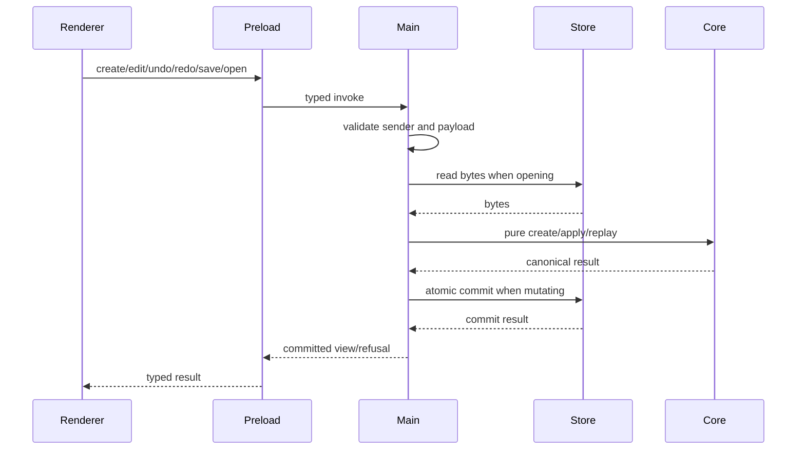
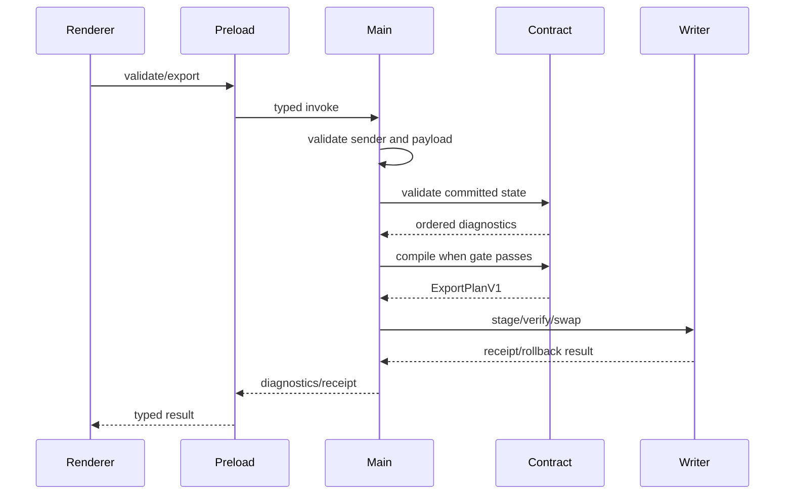

# Design: DSpico Theme Studio MVP

## Technical Approach

Build a Material-only pnpm workspace. Pure `theme-core` handles state, migrations, operations, history, and previews; pure `dspico-contract` handles profile validation, diagnostics, compilation, and reports. Electron main exclusively owns trust and I/O before dispatching into those APIs. Renderer consumes only preload’s narrow typed bridge.

## Architecture Decisions

| Option | Tradeoff | Decision and rationale |
|---|---|---|
| npm/Yarn/pnpm | Corepack | Pin pnpm/lockfile for workspace boundaries. |
| Electron alternatives | Forge configuration | Forge + Vite + React; `start/package` only, excluding distribution. |
| Zod / TypeBox+Ajv | Verbosity | Strict Ajv shares TypeBox disk/IPC schemas. |
| ZIP libraries | Larger stored ZIPs | Pin pure-JS fflate level 0 to prevent compressor drift. |
| Jest/Biome / Vitest stack | Multiple tools | Vitest, fast-check, RTL, Playwright, `tsc -b`, ESLint, and Prettier cover distinct boundaries. |

## File Changes

| File | Action | Description |
|---|---|---|
| `package.json`, `pnpm-workspace.yaml`, `tsconfig.base.json` | Create | Workspace/tooling. |
| `apps/studio/src/main/`, `preload/`, `renderer/` | Create | Adapters, bridge, UI. |
| `packages/theme-core/src/` | Create | Pure authoring logic. |
| `packages/dspico-contract/src/` | Create | Pure target adapter. |
| `packages/test-fixtures/` | Create | Source-cited vectors. |

## Interfaces / Contracts

All schemas use version discriminants. Main implements `ProjectStore`, `Dialog`, `ExportWriter`, `Hasher`, and `IdSource`; pure packages import no Electron, filesystem, process, clock, randomness, DOM, or Node I/O.

```ts
type DiagnosticV1 = {
  version: 1; profileId: "dspico-launcher-v1";
  severity: "error" | "warning" | "suggestion"; ruleId: string;
  location: { document: string; pointer: string };
  normalizedValue: JsonValue | { missing: true };
  evidence: { kind: "source" | "fixture"; ref: string; sha256: string }[];
  message: string; fingerprint: string;
};
// fingerprint = SHA256(canonical([profileId, ruleId, location, normalizedValue]))

type ReportV1 = {
  reportVersion: 1;
  compatibility: { profileId: "dspico-launcher-v1"; launcherCommit: string;
    compilerVersion: string; projectFormatVersion: 1;
    evidence: { path: string; sha256: string }[] };
  diagnostics: DiagnosticV1[];
  acknowledgmentFingerprints: string[];
  files: { path: string; bytes: number; sha256: string }[];
  credits: { name: string; role: string; source?: string }[];
  licenses: { name: string; spdx: string; source: string; notice?: string }[];
};
```

Sort diagnostics by error→warning→suggestion/rule/location/fingerprint; acknowledgments lexically; evidence/files by path; credits by name/role/source; licenses by name/source. `files` excludes `report.json`; `ExportPlanV1.reportSha256` hashes canonical report bytes.

## Trust, Persistence, Recovery

Use `sandbox:true`, `contextIsolation:true`, `nodeIntegration:false`, `webSecurity:true`, allowlisted `app://studio`, restrictive CSP, and deny navigation, popups, webviews, external/file URLs. Main validates schema, sender window/session, frame, and origin. It owns dialogs, filesystem/export adapters, and atomic orchestration: fsync objects, append+fsync journal, temp-rename manifest. Snapshot every 20 operations and save/export; retain 10 snapshots/200 operations. Reopen replays the committed head, reports orphans, and refuses unknown/newer formats without writes.

## Preview, Validation, Export

React renders separate 256×192 top/bottom `PreviewModel`s. Only fixture-proven properties say `launcher-vector-backed`; unsupported fidelity remains `Chromium approximation`. Preview never gates export.

Profile `dspico-launcher-v1` pins clean commit `f3ae63279ab72bc6c83124c752ec79f3247db437`. Strict validation requires trimmed, non-empty Material `name`, `description`, and `author`, plus schema/type checks, `type: material`, integer RGB `0..255`, boolean `darkTheme`, scale `1..200`, alpha `0..31`, and defaults `100/12/14`. Errors and unacknowledged warnings block export.

RFC 8785 JSON, ordered paths, SHA-256, and normalized level-0 ZIP metadata ensure determinism. Main rejects path/symlink escapes, then stages, verifies, and swaps outputs with rollback.

## Data Flow





## Testing Strategy

| Layer | Coverage |
|---|---|
| Unit | Schemas, metadata, replay, fingerprints, reports, launcher goldens, JSON/ZIP bytes. |
| Integration | IPC, write failures, path attacks, receipts, repeated-host hashes. |
| E2E | Offline lifecycle/export/recovery, capability/CSP denials; screenshots prove UI only. |

## Threat Matrix

| Boundary | Cases | Applicability | Safe/failure behavior | Planned RED tests |
|---|---|---|---|---|
| Documentation-like paths | requirements/CMake/MDX/README.sh | N/A: fixtures are data, never executable | No execution | None |
| Git repository selection | `git -C`, relative, absolute | Applicable: fixture capture only | Canonical root; shell-free argv; require clean pinned HEAD or write nothing | Relative/absolute equivalence; hostile/non-repo/dirty/wrong HEAD |
| Commit state | staged/`-a`/empty | N/A: no commit | Read-only | None |
| Push state | tracking/first/refspec | N/A: no push | No remote | None |
| PR commands | head/env/composition | N/A: no PR automation | No surface | None |

## Migration / Rollout

No data migration. Auto-chain reversible, tested ≤400-line slices: workspace/contracts; schemas/history; profile/validation; persistence/recovery; secure IPC; preview; export/E2E. Gate writers until readers validate.

## Open Questions

None.
